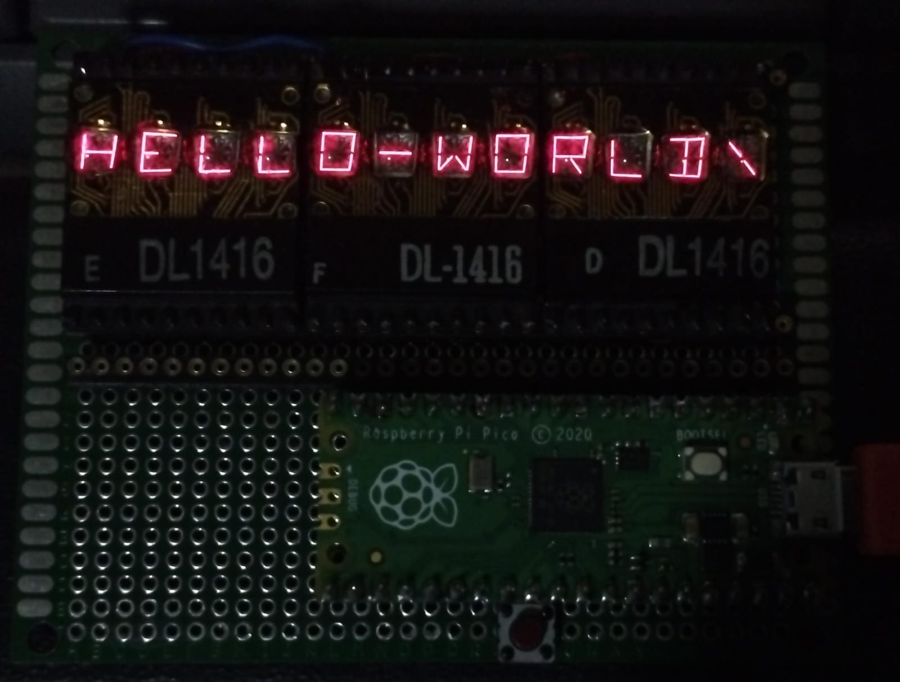

# DL1416 Display Project with Raspberry Pi Pico

This project demonstrates how to connect and control a DL1416 display using a Raspberry Pi Pico.



## Requirements

- Raspberry Pi Pico
- 3 modules of DL1416 Display

## Hardware Connections

Connect the pins of the DL1416 display to the GPIO pins of the Raspberry Pi Pico as shown in the table below:

| Display Pin | Pico Pin | Function       |
|-------------|----------|----------------|
| CE1         | GPIO 5   | Enable DL1     |
| CE2         | GPIO 4   | Enable DL2     |
| CE3         | GPIO 3   | Enable DL3     |
| Cu          | Vcc 3.3  | Cursor         |
| WRI         | GPIO 2   | Write          |
| DS0         | GPIO 8   | Data Select 0  |
| DS1         | GPIO 7   | Data Select 1  |
| D0          | GPIO 13  | Data 0         |
| D1          | GPIO 12  | Data 1         |
| D2          | GPIO 11  | Data 2         |
| D3          | GPIO 10  | Data 3         |
| D4          | GPIO 14  | Data 4         |
| D5          | GPIO 15  | Data 5         |
| D6          | GPIO 9   | Data 6         |


The pins wri, ds0, ds1, d0, d1, d2, d3, d4, d5 and d6 are common between all DL1416 modules.

If you want to add another DL1416 module, just connect the CE (enable) pin to a free GPIO on the Raspberry Pico and declare it in the code.

Exemple: 

```cpp
// modulos[CE1,CE2,CE3, ... CEn], wri, ds0, ds1, d0, d1, d2, d3, d4, d5, d6
DL1416::DLSIEMENS displayDL({5,4,3}, 2, 8, 7, 13, 12, 11, 10, 14, 15, 9);
```

link datasheet: https://cdn.hackaday.io/files/17983769384672/dl1416.pdf

> **Warning**
> Check how to declare the dlsiemens library in the codeCMakeLists.txt and copy picolib/lib/DL1416 to the project

## Compilation and Execution

1. Compile the code:
    ```sh
    mkdir build
    cd build
    cmake ..
    make
    ```
2. Upload the code to the Raspberry Pi Pico:
    - Connect the Pico to your computer while holding the BOOTSEL button.
    - Drag and drop the generated `.uf2` file onto the mounted USB drive.

3. Run the code:
    - The DL1416 display should start showing the characters as programmed.